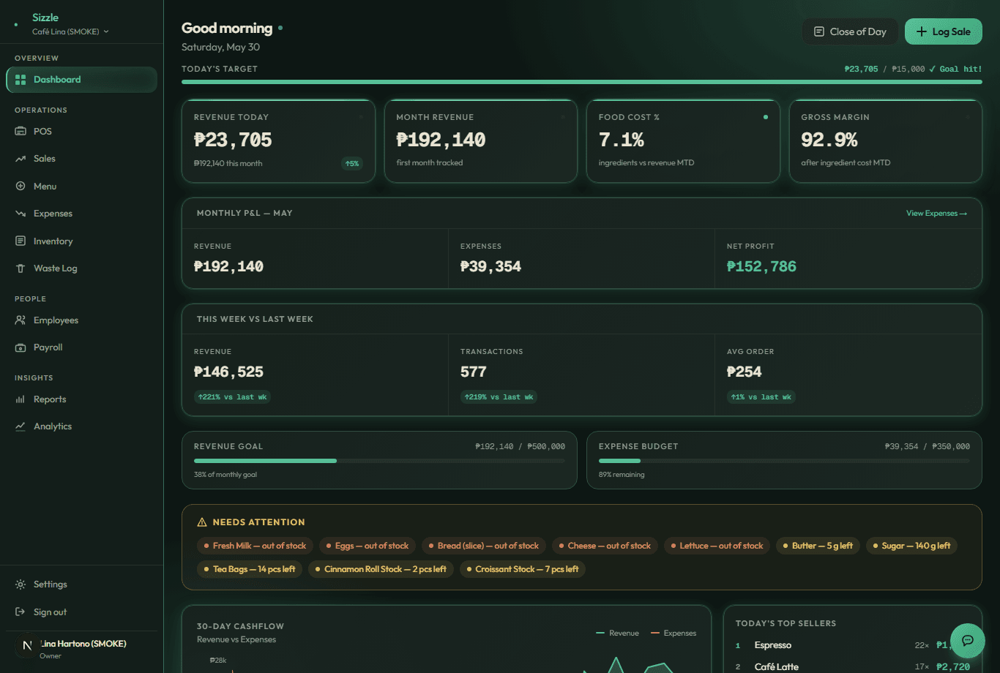

# Tenda Pro

The app I wish every small restaurant owner here had. It's the back-office for a café or restaurant — point of sale, what's in stock, what sold, what it cost, and who's working — in one place instead of five notebooks and a group chat.

Live: **[tenda.ph](https://tenda.ph)**



## Why I built it

I kept seeing the same thing with the food businesses I worked with: sales tracked on paper, inventory guessed at, payroll done in a notebook, and no real idea at the end of the month where the money went. The existing POS systems were either too expensive or built for big chains. So I built the thing I'd actually want to hand a small owner — something they can open on a tablet and just use.

## What's inside

The dashboard is split into the parts an owner actually deals with day to day:

- **POS** — ring up orders, split by category, handle paid vs. unpaid tabs
- **Kitchen display (KDS)** — orders show up in the kitchen as they come in
- **Menu & ingredients** — recipes tied to stock, so selling a dish draws down what it uses
- **Inventory** — stock levels with cost tracking (COGS), plus a waste log for spoilage
- **Sales & reports** — daily sales, unpaid tabs, and reports you can actually read
- **Close day** — end-of-day reconciliation so the numbers tie out
- **People** — employees, shifts, payroll, and a members/roles system
- **Suppliers & expenses** — track who you buy from and where money goes
- **QR menu** — generates a scannable menu customers open on their phone

There's an onboarding flow for first-time setup and a checklist section for opening/closing routines.

## Stack

- **Next.js 16** (App Router) + **React 19**, TypeScript throughout
- **Postgres** via **Drizzle ORM**, hosted on **Supabase**
- **Supabase Auth** with SSR for the login/session side
- **Tailwind v4** for styling, **GSAP** for the landing animations
- `qrcode` for the menu QR, `nodemailer` for transactional email
- Tested with **Vitest** (unit) and **Playwright** (end-to-end)
- Deployed on **Vercel**

## Running it locally

```bash
npm install
cp .env.example .env.local   # fill in your Supabase + Postgres details
npm run db:migrate           # set up the schema
npm run dev
```

Then open `http://localhost:3000`.

Database commands I use a lot:

```bash
npm run db:studio     # browse the data
npm run db:generate   # generate a migration after a schema change
```

## A note

This is a real product I'm actively working on, not a tutorial project — so some folders are messier than others and a few features are still being rounded out. The schema and the dashboard routes are the parts I'm most proud of.
